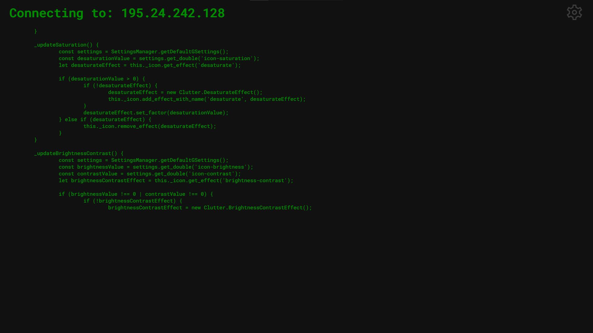

# Hacking Simulator Website

Hosted via [GitHub Pages](https://viggostrom.github.io/Hacking-Simulator-Website/).

## Description
Have you ever wanted to show off your computer wizardry skills? Just open this site, fullscreen it and just mash. You'll be hacking in no time! If you click the cog in the top right corner you can config your hacking.

## Code Source
The code that is scrolling by is from the [ubuntu project](https://github.com/ubuntu/gnome-shell-extension-appindicator/blob/5ebb018e7b2d0219d3cf25c69f5d988b7a53121b/indicatorStatusIcon.js).